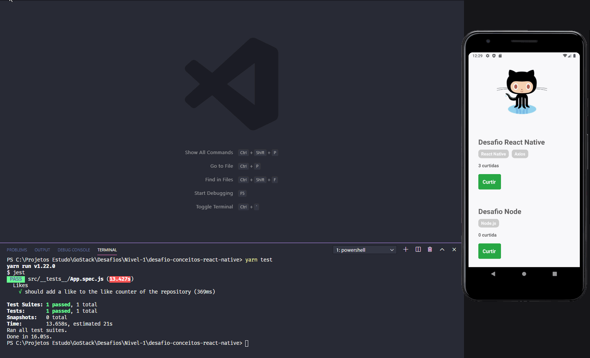

<h1 align="center">
    
</h1>

<h1>
    
</h1>

# Índice

- [Sobre](#-sobre) 
- [Tecnologias Utilizadas](#-tecnologias-utilizadas) 
- [Como Baixar o Projeto](#-como-baixar-o-projeto)

---

## 📝 Sobre

O Gif acima é o resultado do Desafio Conceitos React Native, tendo como objetivo a implementação da funcionalidade "Curtir" cada um dos repositórios cadastrados.

---

## 🚀 Tecnologias Utilizadas

O desafio foi desenvolvido utilizando as seguintes tecnologias: 

- [React Native](https://reactnative.dev/)
- [Axios](https://github.com/axios/axios)

---

```bash

# clonar projeto
$ git clone https://github.com/leticiadeieno/desafio-conceitos-react-native.git

# acessar a pasta frontend
$ cd frontend

# instalar todas as dependências
$ yarn install 

# iniciar aplicação utilizando Emulador Android
$ yarn run react-native run-android

# Caso utilize o emulador iOS, navegue até a poasta ios do desafio através do comando cd e depois execute pd install para instalar todas as dependências para o iOS.
```

---
🙋‍♀️ Desenvolvido por: Leticia Deieno Tadeu